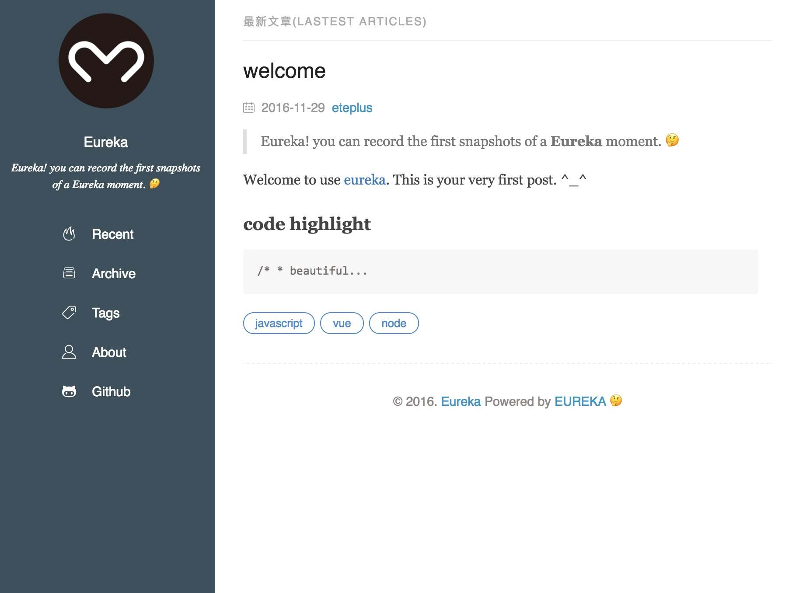
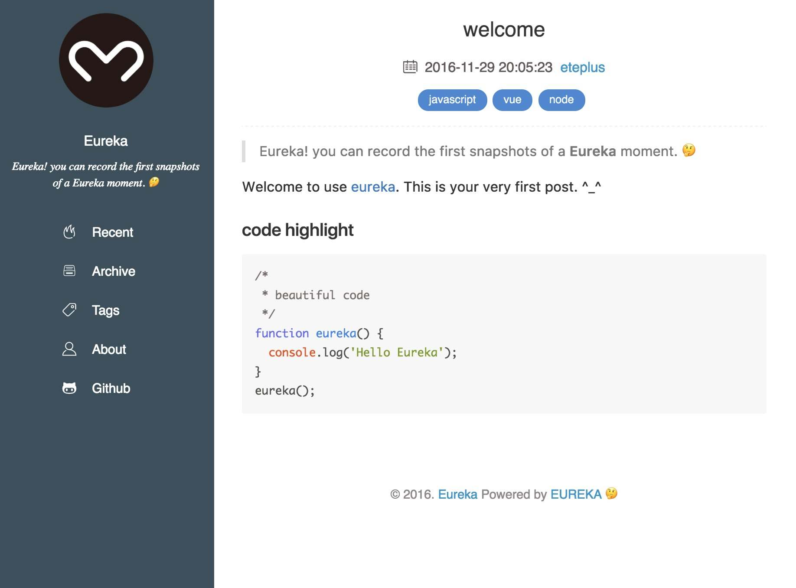
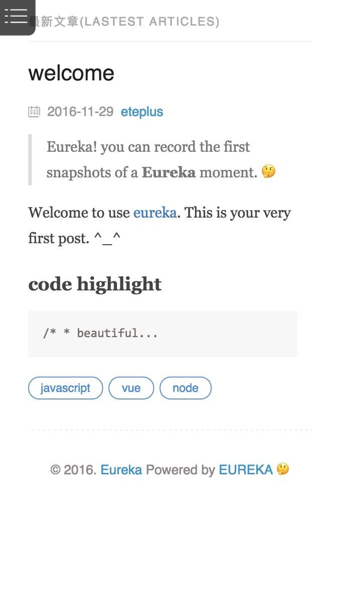
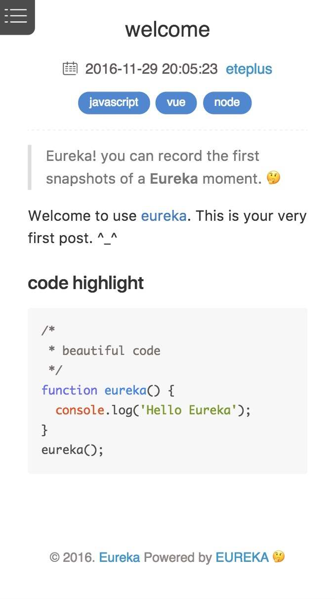

# Eureka 🤔

> Eureka! you can record the first snapshots of a **Eureka** moment. 🤔

> Note: It's entirely personal interest to do this project that feedback learning effects. The project is in development and will add the feature of generating static html files in the future.

🚀 Eureka is a fast, simple and flexible blog framework, powered by [Vue.js](https://vuejs.org/) and [Node.js](https://nodejs.org/).

## Screenshot
<p style="text-align:center;">

</p>
<p style="text-align:center;">

</p>
<p style="text-align:center;">


</p>

## Easy to use

Write your content in Markdown files (or any other text format) or directly in [Vue component](https://vuejs.org/v2/guide/single-file-components.html). Implement your design with JavaScript files, using [Vue.js](https://vuejs.org/).

The primary package that the project will use:

> - Technology Stack
  - [vue](https://vuejs.org/)
  - [vue-router](https://router.vuejs.org/)
  - [vuex](https://vuex.vuejs.org/)
  - [fetch](https://github.com/github/fetch)
  - [purecss](http://purecss.io/)
  - [postcss](https://github.com/postcss/postcss)
    - [postcss-import](https://github.com/postcss/postcss-import)
    - [autoprefixer](https://github.com/postcss/autoprefixer)
    - [postcss-cssnext](http://cssnext.io/)
    - [postcss-bem](https://www.npmjs.com/package/postcss-bem)
- Eureka Command
  - [yargs](https://github.com/yargs/yargs)
  - [shelljs](https://github.com/shelljs/shelljs)
  - [fs-extra](https://github.com/jprichardson/node-fs-extra)
  - [fs-promise](https://github.com/kevinbeaty/fs-promise)
  - [meta-matter](https://github.com/jakwings/meta-matter)
  - [toml-j0.4](https://github.com/jakwings/toml-j0.4)
  - [marked](https://github.com/chjj/marked)
  - [trim-html](https://github.com/brankosekulic/trimHtml)


## Build Setup

You can use [yarn](https://yarnpkg.com/) or [npm](https://www.npmjs.com/).
```bash
# install dependencies
yarn install # or npm install

# link eureka command
npm link

# serve with hot reload at localhost:8080
yarn run dev # or npm run dev

# build for production with minification
yarn run build # or npm run build
```

## Quick Start

-** Create a new post **

> It will create the Hello-Eureka.md to the ** _source/_posts/{year}/{month} folder **

```bash
eureka new "Hello Eureka"
# _source/_posts/2016/12/Hello-Eureka.md
```

-** Generate data files **
> It will generate the config, pages, posts, archive and tag data files separately to the site folder.

>- **posts**:
  - single post file:  ``site/data/posts/{year}/{month}/{title}.json``
  - post list: ``site/data/posts.json``
- **archives**:
  - ``site/data/archives.json``
- **tags**:
  - single tag file: ``site/data/tag/{tag}.json``
  - tag list: ``site/data/tags.json``
- **config**:
  - ``site/data/config.json``
- **pages**:
  - ``site/data/pages/{page}.json`` - ``site/data/pages/about.json``

```bash
eureka generate
# site/data/posts/2016/12/Hello-Eureka.json
```

## Configuration

You can modify site settings in ``_source/_config.toml``

```toml
[site]
name = 'Eureka' # display in the SideBar and <title>
desc = 'Eureka!' # display in the SideBar
url = '' # github page CNAME

# Logo, Favicon is stored in the '_src/static' folder.
logo = 'img/eureka.png' # _src/static/img/eureka.png
# Favicon _src/static/favicon.ico

[meta] # optional <meta>
# default 'Eureka,blog'
keywords = 'Eureka,blog'
# default
description = "Eureka!"

# github
[github]
url = 'https://github.com/eteplus'
show = true
```

## License
MIT
